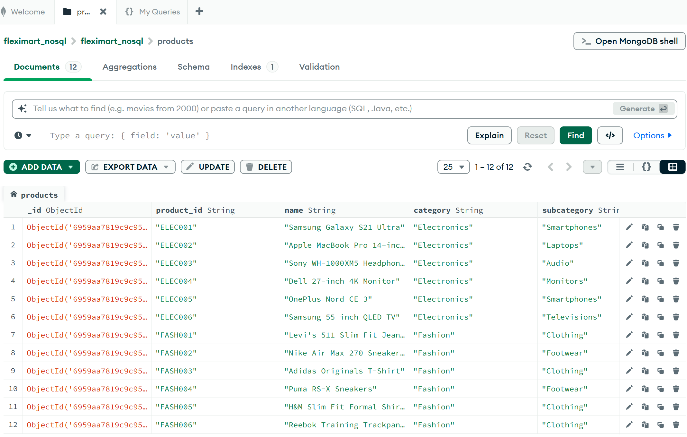
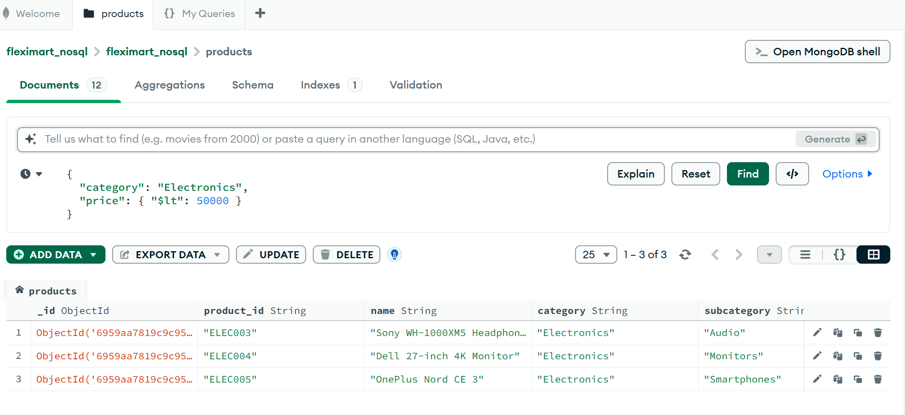
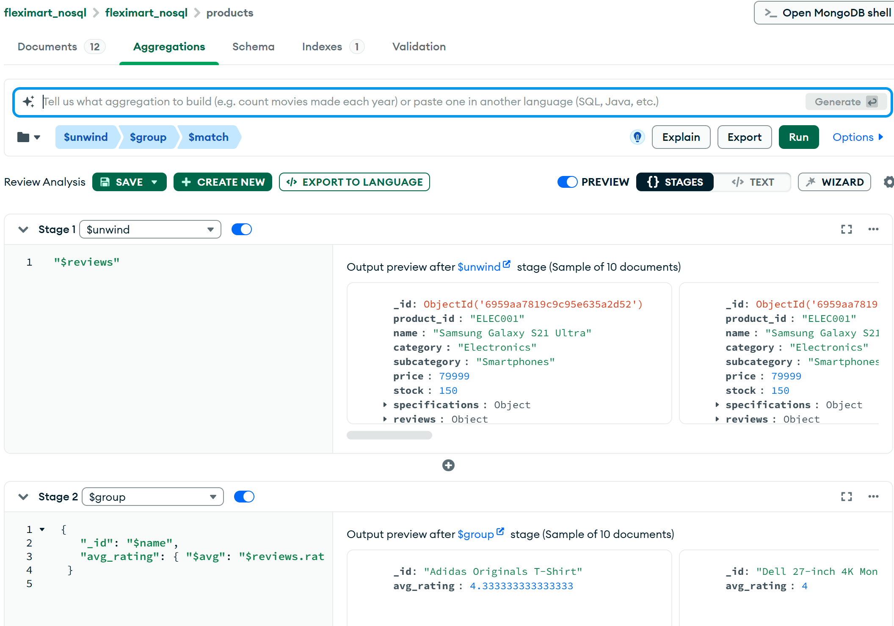
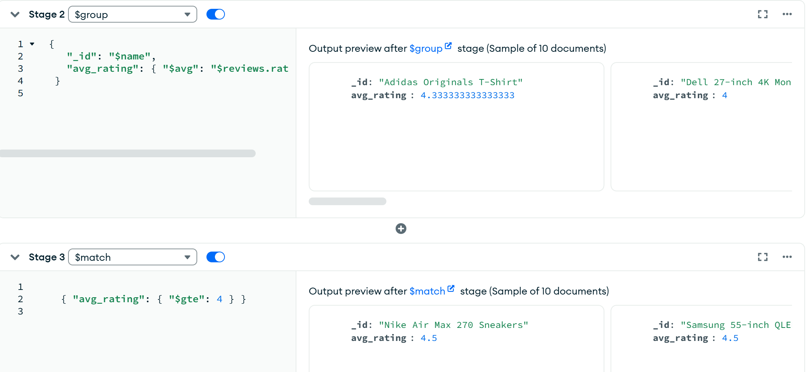
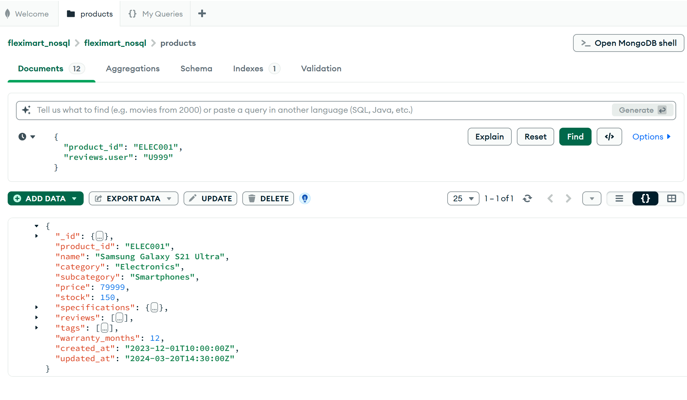
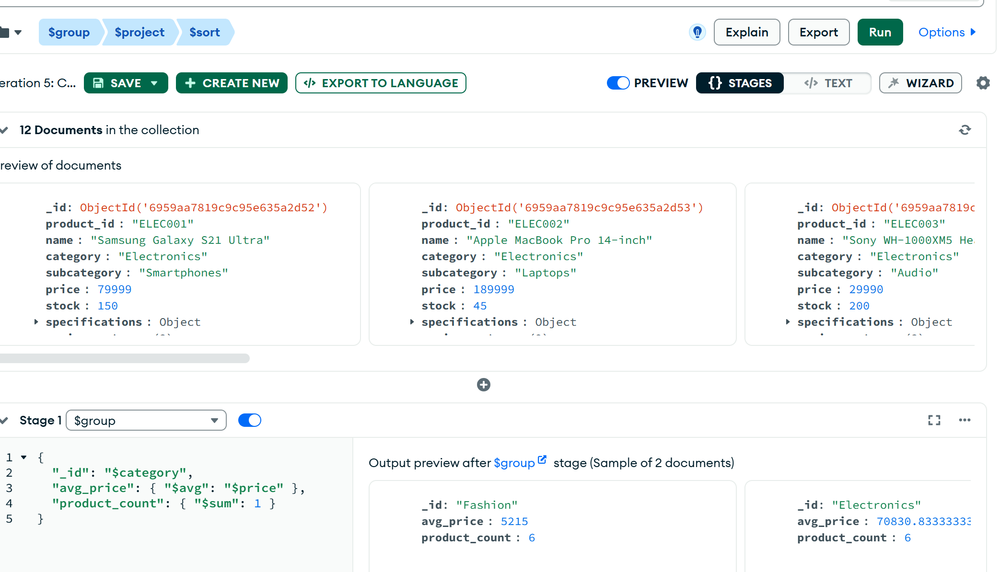
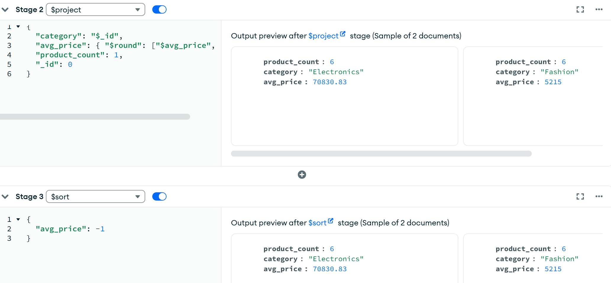

# Part 2: NoSQL Database (MongoDB)

## Overview
This part demonstrates the use of MongoDB to store and analyze semi-structured product catalog data. MongoDB was chosen to handle nested documents such as product specifications and customer reviews.

## Dataset
- `products_catalog.json`  
Contains detailed product information including:
- Specifications (nested object)
- Reviews (array of documents)
- Tags and timestamps

## MongoDB Operations
The following operations were performed:
1. Loaded JSON data into a MongoDB collection (`products`)
2. Queried products by category and price
3. Calculated average product ratings using aggregation
4. Updated documents by adding new reviews
5. Performed complex aggregation to calculate average price by category

## Tools Used
- MongoDB Compass (GUI)
- MongoDB Aggregation Pipeline
- Python (for testing and validation)

## Screenshots
The image files (`image-1.png` to `image-8.png`) are screenshots taken from MongoDB Compass.  

The aggregation pipeline in MongoDB Compass groups products by category, calculates the average price and total product count, and sorts the results by average price in descending order.

They show:
- Data successfully loaded into MongoDB
- Query execution and results
- Aggregation pipelines
- Update operations

These screenshots serve as visual proof of MongoDB operations.

## Files Included
- `products_catalog.json` – Product catalog data
- `mongodb_operations.ipynb` – MongoDB queries and operations
- `nosql_analysis.md` – Design and query explanation
- Screenshot images – Evidence of execution
